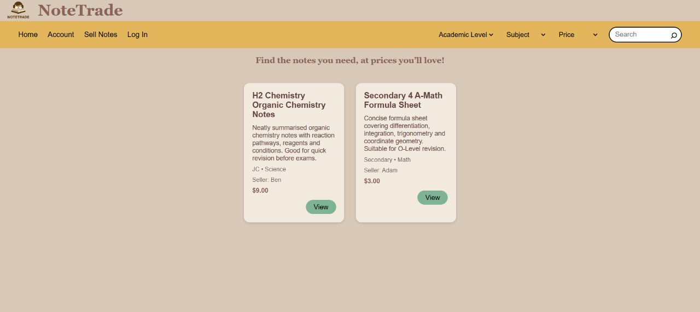
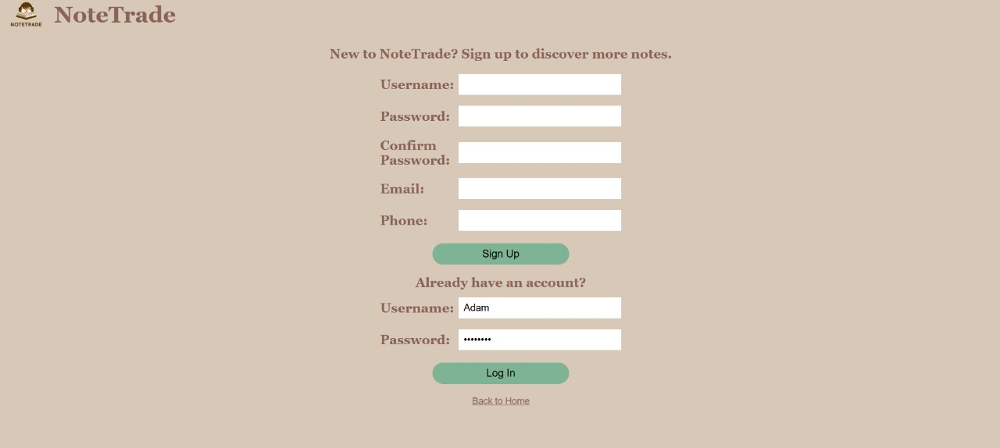
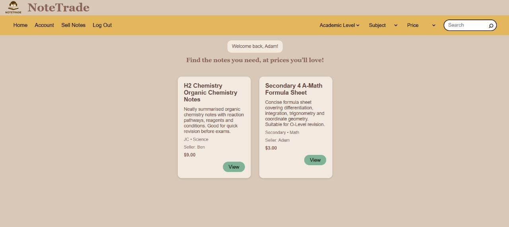
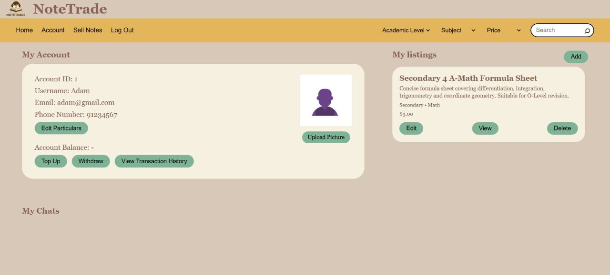
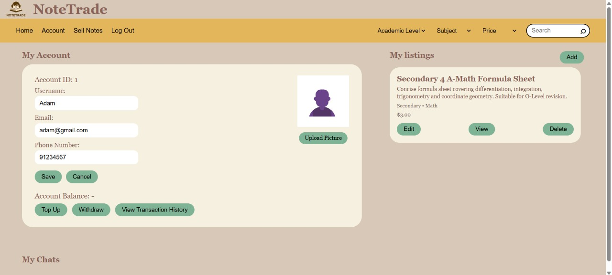
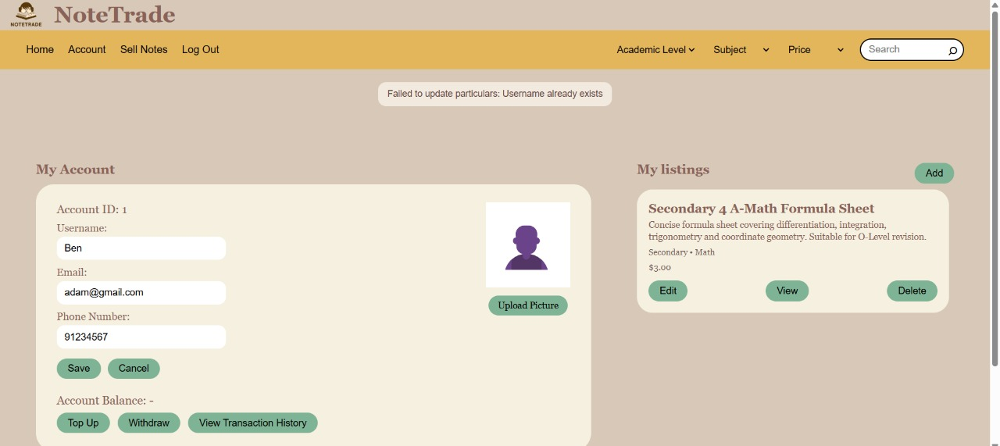
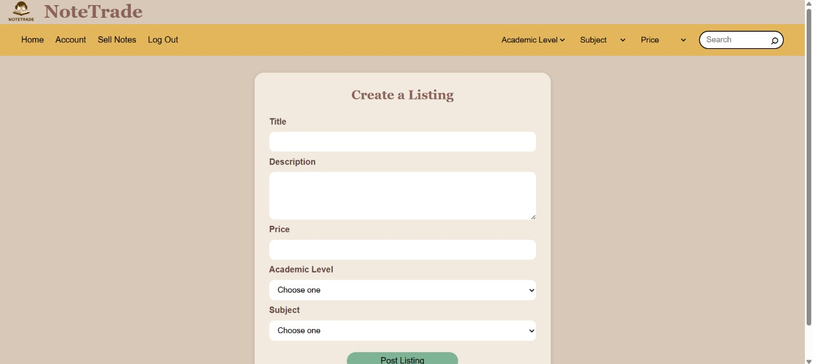
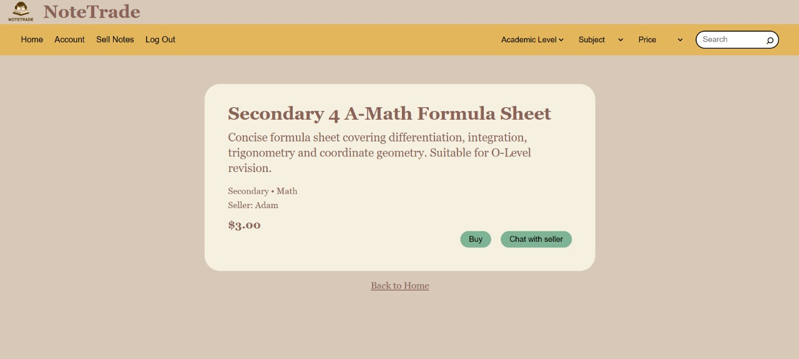
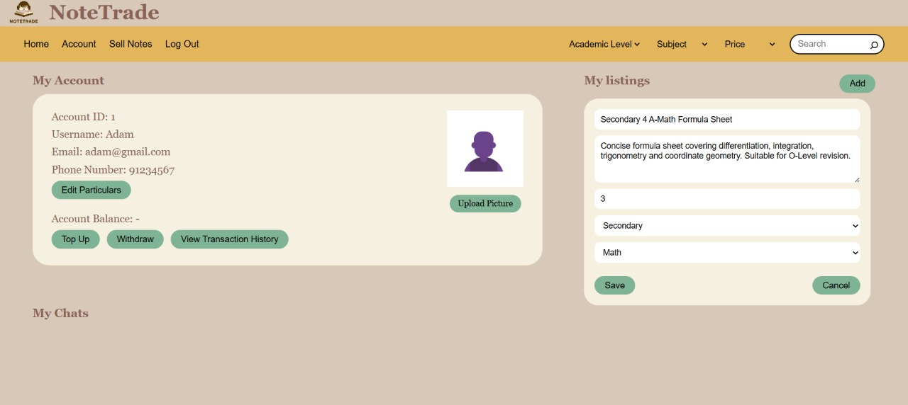
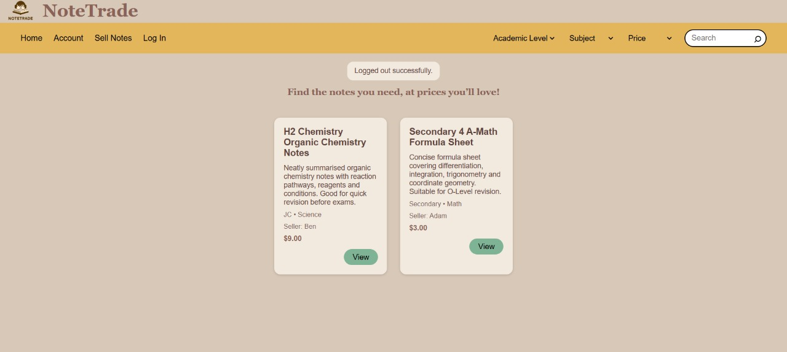

# NoteTrade

Team Name: NoteTraders

NoteTrade is a web platform that allows students to buy and sell study resources such as notes, textbooks, and other learning materials.

The platform aims to make it easier for students to find affordable study resources, while also allowing sellers to clear items they no longer need. Instead of relying on informal chats or small friend groups, NoteTrade provides a more organised space where students can browse listings and manage their own items.
## Motivation
Students often exchange notes and textbooks through informal channels such as messaging apps or friend groups. However, this limits the number of people who can view, buy, or sell these resources.

NoteTrade aims to provide a more open and organised platform where students can easily browse available study resources, while sellers can list items they no longer need.
## User Stories
- As a student seller, I want to create an account and log in securely, so that I can manage my listings and account details. 
- As a student seller, I want to create listings for my used notes or textbooks, so that other students can view and buy them.
- As a student seller, I want to edit or delete my listings, so that I can update item details or remove items that are no longer available.
- As a student buyer, I want to browse available listings, so that I can find second-hand notes or textbooks that I need.
- As a student buyer, I want to view listing details such as title, description, price, and seller information, so that I can decide whether I am interested in the item.
- As a user, I want to update my account particulars, so that my personal information stays accurate. 
- As a user, I want to receive clear error messages when something goes wrong, so that I know what to correct.
- As a user, I want usernames to be unique, so that each account can be clearly identified.

## Features Implemented
### 1. Authentication (core)
**[Proposed]**

Allows users to create an account and log in using a username and password. To enhance security, the platform will also support two-factor authentication (2FA), where users verify their identity using a one-time password (OTP) sent to their registered email address or phone number. This ensures that only authorised users can access their accounts, manage listings, and perform transactions on the platform.

**[Current progress]**

We have created a MongoDB collection hosted on MongoDB Atlas for accounts that can record the username, password, email and phone number for each account

When creating an account:
the platform will check if the username exists already, if so, it will prevent the new user from creating an account with a duplicate username
Passwords will need to be at least 8 characters, consisting of 1 uppercase alphabet, 1 lowercase alphabet, 1 number and 1 special character
The new account will have a unique account id once created
Users can upload a profile photo for their account

Users will be able to update their account details such as username, password, email and phone number. Users are also able to login to their account if they provide the correct username and password.

**[Future works]**

By Milestone 2: 
Hash the passwords stored in the database to increase security
Keep track of the amount of money that belongs to an account (related to the transaction feature)

By Milestone 3:
Enable users to delete their account
Enable users to save their profile picture

### 2. Listing of items (core)
**[Proposed]**

Allows sellers to create listings for their study materials by placing them under the appropriate category and providing key details such as the title, description, and price. This helps organise resources clearly and makes it easier for buyers to browse and understand what is being offered.

**[Current progress]**

We have created a collection on MongoDB that keeps track of the listing title, description, price, academic level, subject. Listings can be created, displayed, updated and deleted.

**[Future Works]**

By Milestone 2:
Link the listing to the sellers
Enable pictures of the listing to be saved

### 3. Transaction of items (core)
**[Proposed]**

Allows users to top up money into their account balance and use this balance to purchase items on the platform. Sellers will be able to receive payments through the platform, while users can also withdraw their balance easily. This provides a simple and convenient way to facilitate transactions between buyers and sellers.

**[Current progress]**

None

**[Future works]**

By Milestone 2: 
Implement this feature so that when a buyer presses “buy”, the balance remaining in the buyers account decreases, while the sellers’ account balance increases

### 4. Search and Filter (core)
**[Proposed]**

Allows users to search for listings using a search bar and narrow down results through filters such as academic level, module code, subject, price, and category. This improves the browsing experience by helping users quickly find study materials that are relevant to their needs.

**[Current Progress]**

None

**[Future Works]**

By Milestone 2:
Implement a search bar where users can search for keywords in the listing title or description
Implement a filter function whereby users can filter listing via price range, academic level, and subject

By Milestone 3:
Allow users to sort listings by alphabetical order or by price (increasing and decreasing)

### 5. Chat (extension)
**[Proposed]**

Allows interested buyers to message sellers directly to ask for more information about the listed item or to negotiate the price. This enables smoother communication between users and helps buyers make more informed decisions before purchasing.

**[Current progress]**

None 

**[Future Works]**

By Milestone 3:
Implement the chat feature between two users

### 6. Favourites (extension)
**[Proposed]**

Allows buyers to save or like listings that they are interested in so they can revisit them later. This gives users a convenient way to keep track of items without having to search for them again.

**[Current Progress]**

None

**[Future works]**

By Milestone 3:
Implement the favourites for each account by adding another field under the accounts collection that keeps track of the favourite listings’ id

## Tech Stack

**Frontend:** React, TypeScript

**Backend:** Go, Gin

**Database:** MongoDB

**Version Control:** GitHub


## API Routes Used

| Method | Route | Description |
|---|---|---|
| POST | `/signup` | Creates a new user account |
| POST | `/login` | Logs a user into their account |
| POST | `/updateUser` | Updates user particulars |
| POST | `/createListing` | Creates a new listing |
| POST | `/updateListing` | Updates an existing listing |
| POST | `/deleteListing` | Deletes a listing |
| GET | `/listings` | Retrieves all listings |
| GET | `/users` | Retrieves all users |
## Run Locally

Clone the project

```bash
  git clone https://github.com/TYS2/NoteTraders 
```

Go to the project directory

```bash
  cd NoteTraders
```
### Running the Backend

Go to the backend folder 

```bash
cd backend
```

Install dependencies 

```bash
  go mod tidy
```

Run the backend server 

```bash
  go run main.go
```


### Running the Frontend

Go to the frontend folder 

```bash
cd frontend
```

Install dependencies

```bash
  npm install
```

Start the server

```bash
  npm run dev
```

## How to use
1. Open the website and view the listings on the homepage.

2. Click on the login button to go to the login and sign-up page.

3. Sign up for a new account or log in with an existing account.


4. After logging in, continue browsing the listings on the homepage.

5. Go to the account page to view your account details and the listings you have created.

6. Edit your account details if needed. If the username already exists, an error message will be shown.


7. Create, view, edit, or delete your own listings.



8. Log out of your account when you are done.

## Team Members
- Teng Ywee See
- Xue XinYu
